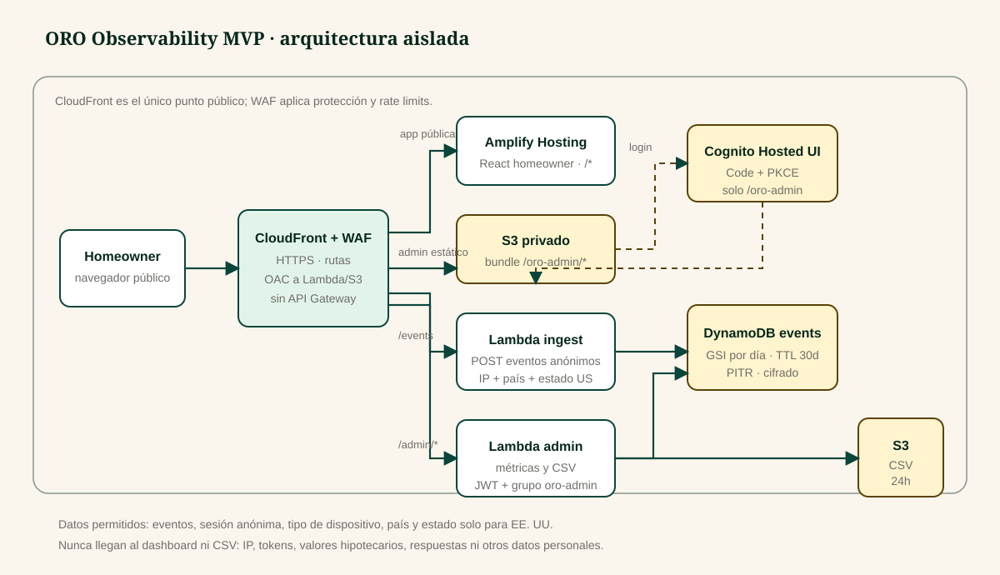

# ORO Observability MVP

The observability layer records anonymous interactions so the ORO team can understand the product journey without changing calculations, the public experience, or option comparison.

## What it measures

The browser tracker is optional and never blocks the interface. When enabled, it records bounded events: journey starts, completed steps, results, product details and selections, comparisons, and restarts. Properties use controlled enums; it never sends home values, balances, rates, cash needs, age, answers, names, email addresses, or free text.

CloudFront supplies the trusted IP address and geography. The country is stored for every visitor, while the state code is stored only when the country is `US`; all other regions are normalized to `XX`. The IP address is retained only in DynamoDB for 30 days and is never included in the interface, logs, or exports.

## Architecture and security

CloudFront with WAF is the only public entry point. It keeps the homeowner app in Amplify, serves the admin bundle from private S3, and routes both APIs to Lambda Function URLs protected by Origin Access Control and SigV4. There is no API Gateway, VPC, ALB, NAT, or additional processing service.

The ingestion Lambda validates size, schema, UUIDs, allowed events, and allowed properties before writing to DynamoDB. The table is encrypted, uses a 30-day TTL, PITR, and a per-day index with four shards. The admin Lambda queries only that index, returns bounded metrics, and creates temporary CSV files in a private bucket with a 24-hour expiry.

The homeowner app and comparison remain fully public. Only `/oro-admin` uses Cognito Hosted UI with Authorization Code + PKCE. The SPA client has no secret; metrics and exports require a valid access token for the `oro-admin` group.

## Operations

The manual **ORO Observability Deploy** workflow uses GitHub Actions OIDC and the protected `oro-production` environment; it does not use access keys. With `OBSERVABILITY_TRACKING_ENABLED=true`, it builds the public bundle with tracking, publishes the private admin, and updates only the `oro-*` stack and distribution.

The dashboard shows unique sessions, guided completion, product exploration, device, and location. The CSV contains only the received date, event, country, US state when available, device, allowed properties, and an ephemeral session pseudonym.
